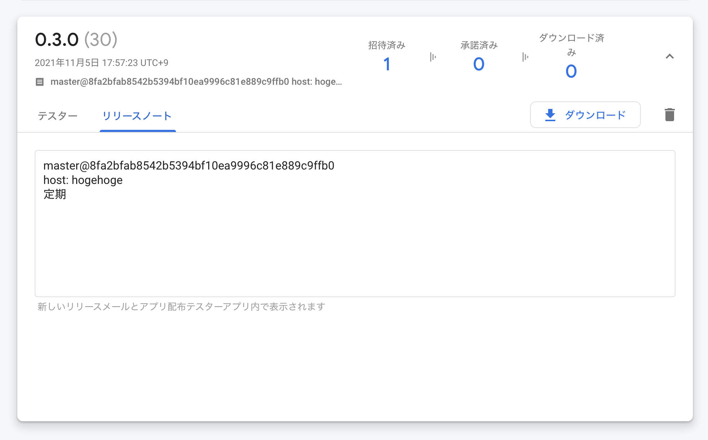

開発用の Android アプリの確認をするために Firebase App Distribution を入れる仕事をした。

元々今所属しているチームでは、Bitrise の artifact 機能を用いてビルドしたバイナリをそこへアップロードし、その URL を QA 確認時やデザイン確認時に伝え、URL は Google spreadsheet で管理というフローが元々採用されていた。しかしその URL を知らないとそもそも確認できなかったり、インストール時に URL を端末で踏むのが面倒、シートの更新忘れる、といった背景があった。やったことは以下のようなものたち。

- App Tester アプリを検証端末にインストール
- 任意のタイミングでぽちぽちしてデプロイできるようにするために、Firebase App Distribution へデプロイする workflow をどこかに作成
- いつでもリリース相当のものを開発版でも見られるように、ストアへのリリースするタイミングで Firebase App Distribution へも開発用の環境のバイナリを自動で上げる

Web ブラウザで配布用ページへアクセスすればアップデートを受け取れるため、App Tester アプリは必ずしも入れないといけないことはないんだけど、Chrome のブックマーク入れてもらったりするのが面倒なので検証端末は一律で入れ、App Tester 経由でアップデートを受け取ってもらうようにした。

Firebase App Distribution は、アップロードしたバイナリに対し任意のリリースノートを紐付けられるので、workflow 実行時に任意入力の値として受け付けて、git のコミットハッシュやビルドしたブランチ名を追加で付与してアップロードしている。バージョンコードがかぶると上書きされるんだけど、今仕事で見ているアプリはビルドした時刻からバージョンコードを自動生成するのでそこは特に手を入れなかった。


この手の改善は前職でもやりまくっていたので別に大したことではないが、課題の発見及び解決という観点で委譲していくのも重要だなと改めて思いつつ、困ってるならさっさとやるところのバランスを探して生きている、という気付きを得た。



- - - 




```yaml
name: Deploy app to firebase app distribution

on:
  workflow_dispatch:
    inputs:
      branch:
        description: "Branch"
        required: true
        default: "develop"
      host:
        type: choice
        description: "アプリの向き先"
        required: true
        options:
          - staging
          - integration
      release_notes:
        description: "リリースノートが必要なら入れてね"
        required: false

jobs:
  deploy-app-to-app-distribution:
    runs-on: ubuntu-latest
    timeout-minutes: 10
    steps:
    - uses: actions/checkout@v2
      with:
        ref: ${{ github.event.inputs.branch }}
    - name: set up JDK 11
      uses: actions/setup-java@v2
      with:
        distribution: adopt
        java-version: 11
    - name: Build
      run: |
      HOST=${{ github.event.inputs.host }} ./gradlew assembleDebug -q
    - name: upload artifact to Firebase App Distribution
      uses: wzieba/Firebase-Distribution-Github-Action@v1
      with:
        appId: ${{ secrets.FIREBASE_DEV_APP_ID }}
        token: ${{ secrets.FIREBASE_TOKEN }}
        releaseNotes: ${{ github.event.inputs.release_notes }}
        groups: tester
        file: /path/to/app
```


