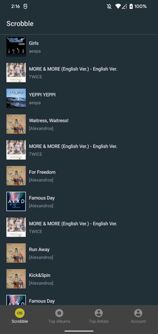
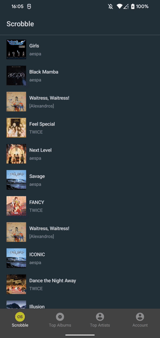
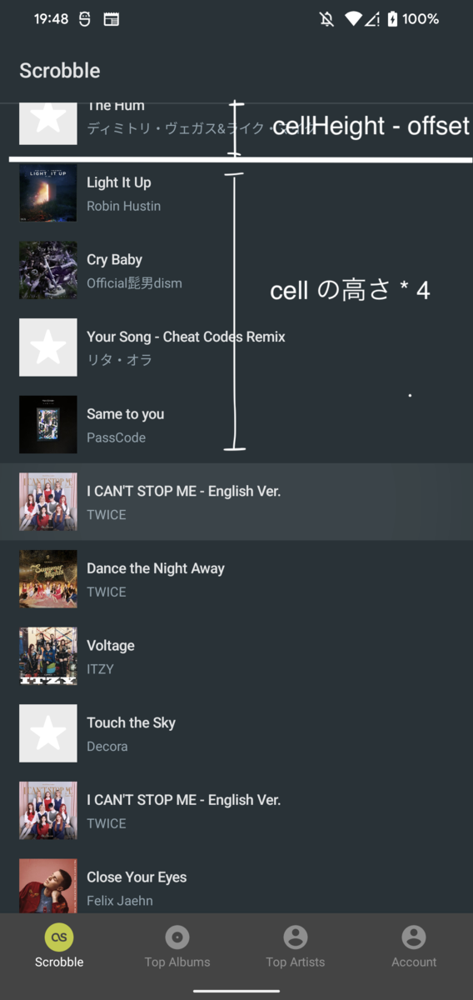

有給消化第 1 弾を迎えたので、マジでわからんリストの 1 つである Jetpack Compose ノックを https://github.com/mataku/SunsetScrob でひたすらしている。LazyColumn を持つ画面から、(Lazy)Column を持つ画面へ遷移する場合に、画面がちらつかせないためにはどうすれば良いかなというのを考えていた。いわゆる何らかの Web API をリクエストして表示するリストの 1 要素をタップしたら、詳細がある画面へ遷移する (大体この画面でも Web API リクエストがある) 際のアクション。



  <details>
    <summary> 試した様子 </summary>
      <table>
        <tbody>
          <tr>
            <td>同一画面内で一覧と詳細を切り替え</td>
            <td>Jetpack Navigation Compose Animation</td>
          <tr>
          </tr>
            <td>
              
            </td>
            <td>
              
            </td>
          </tr>
        </tbody>
      </table>
  </details>


Shared element transition 用のコンポーネントは (多分まだ) ないので、画面遷移用の状態をどこかに保持しないと行けなさそう。今回の場合では以下になる。
- 画像データ
- 一覧画面での表示位置



## 同一画面内で一覧と詳細を切り替え

試した様子にある左の GIF。遷移する元の画像の位置を保持した上で拡大縮小し、詳細から戻ってくる際に一覧画面の alpha 値を [Animatable#animateTo](https://developer.android.com/reference/kotlin/androidx/compose/animation/core/Animatable?authuser=1#animateTo(kotlin.Any,androidx.compose.animation.core.AnimationSpec,kotlin.Any,kotlin.Function1)) を使って徐々に上げることでばつっとならないようにしている。

リスト内のタップした要素の位置の特定には、[LazyListState](https://developer.android.com/reference/kotlin/androidx/compose/foundation/lazy/LazyListState) に画面内一番上 ( ≠ List#first )に表示されている item の index である `firstVisibleItemIndex` と、画面内一番上に表示されている item がどれだけスクロールされているかの `firstVisibleItemScrollOffset` が保持されているので、それらとタップした item の index を用いて地味に計算している。詳細画面では座標を受け取り、Modifier.offset を設定して一覧画面でタップした画像の位置に合わせた上で、表示後に size を拡大させた。


<details>
<summary> 雑な求め方 </summary>



<ul>

<li>4 = (タップされたリストの index) - (画面内一番上の表示されている index: firstVisibleItemIndex) </li>
<li>一番上のセルの高さ = (セルの高さ) - (スクロール量: firstVisibleItemScrollOffset) </li>

</ul>

</details>





```kotlin
// 詳細画面
val animateState = remember {
  Animatable(0F, 1F)
}

val offset = (y.dp) - ((y.dp) * animateState.value)
val imageSize = 48
val horizontalPadding = 32
val size = imageSize.dp + ((screenWidthDp - imageSize - horizontalPadding) * animateState.value).dp

LazyColumn(
  ...

  AsyncImage(
    model = ImageRequest.Builder(LocalContext.current)
      .size(1000)
      .data(imageUrl ?: R.drawable.no_image)
      .build(),
    contentDescription = "artwork image",
    modifier = Modifier
      .padding(horizontal = 16.dp, vertical = 8.dp)
      // AnimateState の変化を検知して size と offset の値を変化させる
      .absoluteOffset(
        0.dp,
        offset
      )
      .size(size)
    )
  )
)

// 0F -> 1F に値を変化させる
LaunchedEffect(Unit) {
  coroutineScope.launch {
    animateState.animateTo(
      1F,
      animationSpec = tween(durationMillis = 1000)
    )
  }
}
```

```markdown
- Container Screen
  - List Screen with State Holder (一覧画面)
  - Detail Screen with State Holder (詳細画面)
```

画面構成としてはこんなんで、リストの要素タップ時に画像 URL と座標を詳細画面へ渡して表示を切り替えている。naigation-compose で画面遷移はせず複数の画面を 1 画面で管理しているので正直どうにでもなるため、詳細画面から戻っている途中で一覧画面の alpha を上げることで、スケールダウンし終わった後にばつっとならないようにしている。

あとはリストから拡大して画面遷移する際に、画像を再読み込みさせたくないのでキャッシュさせたい。coil を利用している場合は、ImageRequest でサイズを指定しないと画像のコンポーネントに Fit するサイズでキャッシュされる。何も考えずに model に画像 URL を渡したらリスト内の画像サイズである 48dp から画面幅に近い幅に拡大した際にがびがびになった。これは v2.1.0 で試した。



```kotlin
// キャッシュ設定 (ディスクキャッシュのみ有効)
val imageLoaderBuilder = ImageLoader.Builder(applicationContext)
  .memoryCachePolicy(CachePolicy.DISABLED)
  .diskCachePolicy(CachePolicy.ENABLED)
  .networkCachePolicy(CachePolicy.ENABLED)
  .diskCache {
    DiskCache.Builder()
    .directory(dir)
    .maxSizeBytes(256L * 1024L * 1024L) // 256MB
    .build()
  }.crossfade(true)

if (BuildConfig.DEBUG) {
  imageLoaderBuilder.logger(DebugLogger())
}
Coil.setImageLoader(imageLoaderBuilder.build())

// 画像表示
AsyncImage(
  model = imageUrl,
  contentDescription = "$trackName artwork image",
  modifier = Modifier.size(48.dp)
)

// size 指定で ImageRequest を作成
AsyncImage(
  model = ImageRequest.Builder(LocalContext.current)
    .size(1000)
    .data(imageUrl)
    .build(),
  contentDescription = "$trackName artwork image",
  modifier = Modifier.size(48.dp)
)
```


### ◯
- 戻った際にばつっとしない
- 遷移時の融通が効く

### ×
- 1 画面内で一覧と詳細を切り替えているので、クラス内のコードや状態管理が複雑になる
- navigation-compose による画面遷移をしたい場合、ここだけ管理下から外れる



## Jetpack Navigation Compose Animation

試した様子にある右の GIF。ここでも同じように LazyListState の要素を使った座標位置や画像 URL といった画面遷移用の状態を保持するのは変わらないものの、[https://google.github.io/accompanist/navigation-animation/](https://google.github.io/accompanist/navigation-animation/) を利用することで、navigation-compose による画面遷移の管理下におきつつ、詳細画面から戻った際にばつっとなるのを減らす。

```kotlin
composable(
  "list",
  enterTransition = {
    fadeIn(tween(1000))
  },
  exitTransition = {
    fadeOut(tween(1000))
  }
) {
  ListScreen(
    state = rememberListScreenState(navController = navController)
  )
}

composable(
  "detail?imageUrl={imageUrl}&xPoint={x}&yPoint={y}",
  arguments = listOf(
    navArgument("imageUrl") {
      type = NavType.StringType
    },
    navArgument("x") {
      type = NavType.IntType
    },
    navArgument("y") {
      type = NavType.IntType
    }
  ),
  content = {
    val arguments = it.arguments ?: return@composable
    val x = arguments.getInt("x", 0)
    val y = arguments.getInt("y", 0)
    val imageUrl = arguments.getString("imageUrl")!!

    DetailScreen(
      x = x,
      y = y,
      imageUrl = imageUrl,
      screenState = rememberDetailScreenState(
        navController = navController,
      )
    )
  }
)
```

### ◯
- navigation-compose による画面遷移に乗っかれる
- 画面構成や状態管理は画面内の役割を果たすことのみを考えられるので複雑さが軽減される

### ×
navigation-compose による画面遷移なので戻った際の表示の融通の効かせ方は制限される



## 感想

結局はどう表現したいかによるのでなんとも言えないけれど、今実装してくれとなったら accompanist 使うのを軸に考える。可変セルならどうするかわからないので、仕事で当たったら考える。本当にやり方がないのか？というのは調べきれていない。

MotionLayout を使うともう少し楽になるとは思うが、あっちもあっちで記法が独特なので GA になったら見てみたい。


## 参考

v2.1.0 - coil-kt/coil  
https://github.com/coil-kt/coil/tree/192070b879194e268fb2d80dd73d3767907194eb

LazyListState - Android Developers  
https://developer.android.com/reference/kotlin/androidx/compose/foundation/lazy/LazyListState
