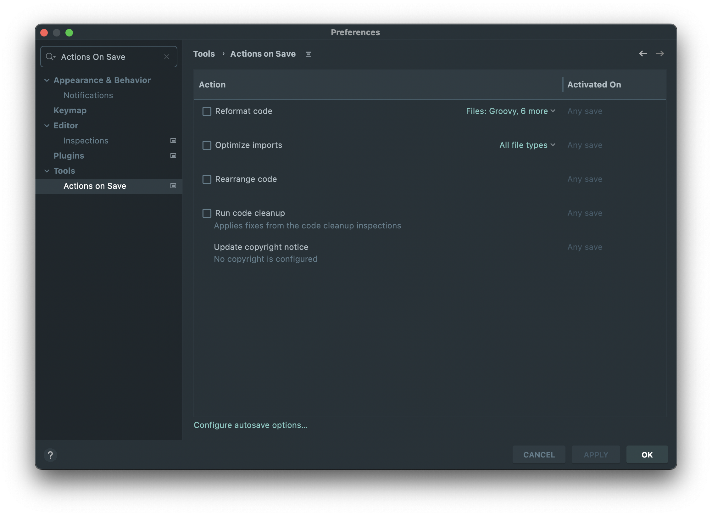
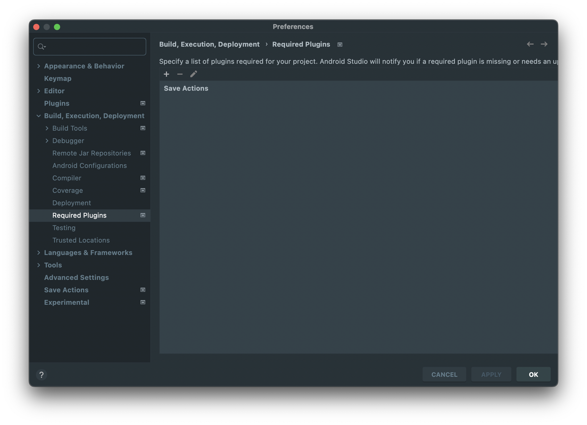

IntelliJ IDEA 2021.2 で Actions On Save という機能が追加されており、Save Actions plugin でやっていたようなファイルの保存時にコードフォーマットすることが可能になっていた。

https://www.jetbrains.com/idea/whatsnew/2021-2/


<div>
  
  <div class="embed-caption" style="text-align: center; font-size: 14px; margin-top: -24px; margin-bottom: 32px;">
    Android Studio Eel 上における設定項目
  </div>
</div>


Android アプリ開発でいうと、現時点での安定版 Android Studio Eel は Intellij IDEA 2022.1 なのでもちろん使える。ただチーム開発という観点だと、設定項目が `${project.rootDir}/.idea/workspace.xml` に保存され、このファイルは多くの場合でバージョン管理しないのでチームで設定を共有するのが難しい。そのためまだ Save Actions を利用している。セットアップ時にこれ入れてくれ + ぽちぽち設定してくれというのもあれなので、Save Actions をプロジェクトの必須プラグインとするのと、Save Actions の設定項目をコードで管理している。



- - - 


<div>
  
  <div class="embed-caption" style="text-align: center; font-size: 14px; margin-top: -24px; margin-bottom: 32px;">
    Android Studio 上における required plugin 設定
  </div>
</div>


設定すると以下のような内容で `${project.rootDir}/.idea/externalDependencies.xml` が作成される。ここでは指定していないが、バージョンの下限と上限も指定できる。

```xml
<?xml version="1.0" encoding="UTF-8"?>
<project version="4">
  <component name="ExternalDependencies">
    <plugin id="com.dubreuia" />
  </component>
</project>
```

Save Actions の設定ファイルは `${project.rootDir}/.idea/saveactions_settings.xml` なので、これら 2 つをバージョン管理する。



- - - 

ひとまず https://youtrack.jetbrains.com/issue/IDEA-276784/Store-Actions-on-Save-Settings-in-VCS-as-xml-file-in-.idea-folder に +1 しておいた。
