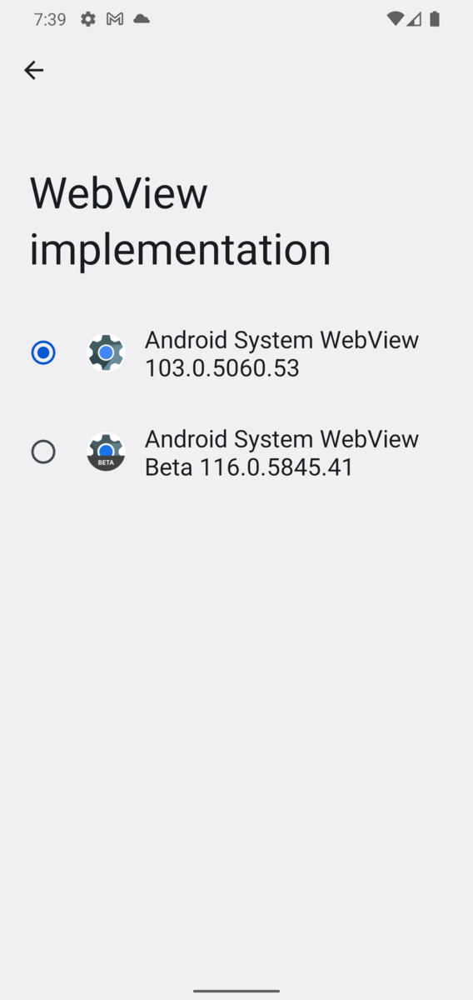
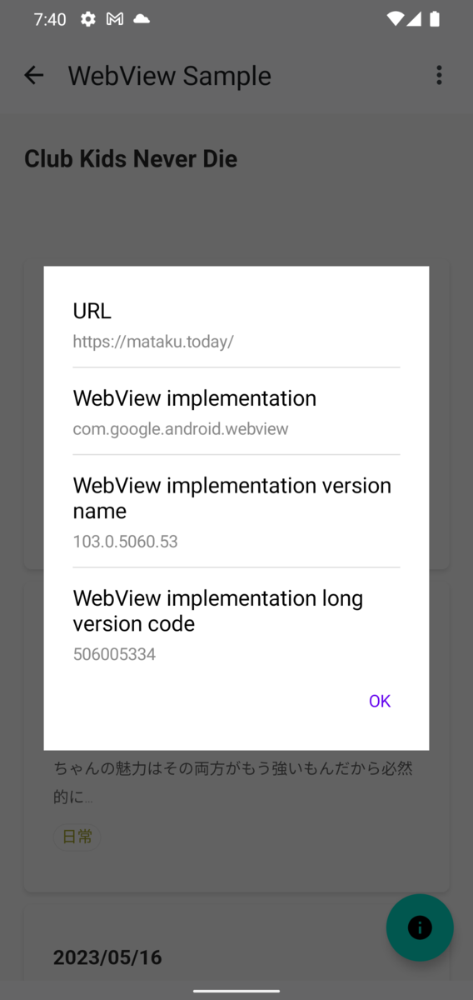
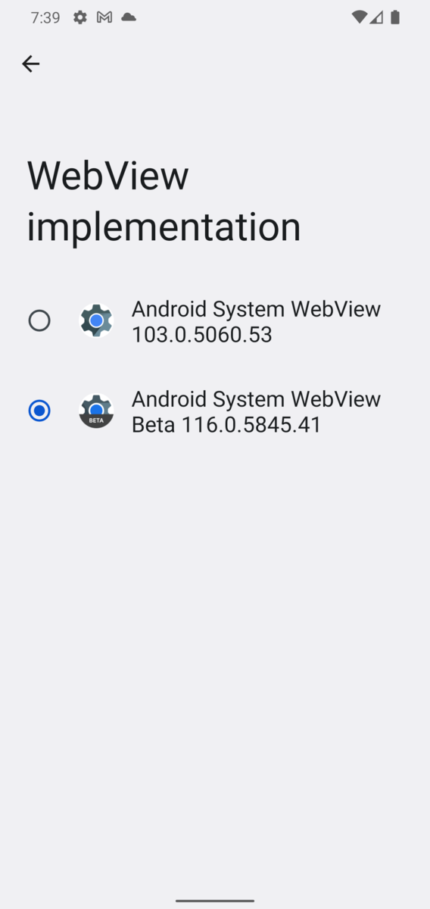
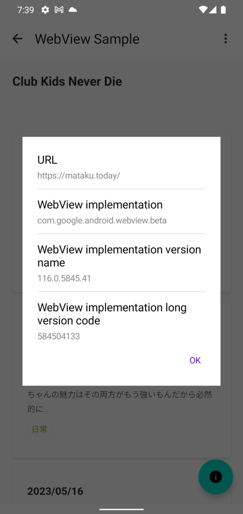

Android WebView 起因で問題があった際に、WebView 実装で使っているアプリケーションを取得してあれこれしたいみたいな話があり、[WebViewCompat#getCurrentWebViewPackage](https://developer.android.com/reference/androidx/webkit/WebViewCompat#getCurrentWebViewPackage(android.content.Context)) でパッケージ取得できる話をしていた。

WebViewCompat#getCurrentWebViewPackage は [PackageInfo](https://developer.android.com/reference/android/content/pm/PackageInfo) が返ってくるので、Android アプリケーションに紐づく情報を、特に権限付与なしに取得できる。

- - -

WebView 実装で何を使うかは開発者向けオプションから選択できる。Android 10 以降では WebView がデフォルトなので、それ以降なら何もしなければ WebView なはず。

| 開発者向けオプション  | PackageInfoからの取得例 |
| :--: | :--: |
|    |    |

例えば WebView beta を指定した場合は以下のようになる。

| 開発者向けオプション | PackageInfoからの取得例 |
| :--: | :--: |
|    |    |

- - - 

サンプルは以下。  
https://github.com/mataku/composable-snippets/blob/bed4ce5de98e11e88ca86d7a71b4d60a42b714bc/app/src/main/java/com/mataku/snippets/ui/compose/sample/WebViewScreen.kt

PackageInfo が取得できるということは、versionName (versionCode) も取得できるので、例えば バージョン X 以下のものを利用していたらなにかアクションするようなことが可能になる。そんな話を仕事でしていたのでこの時代でも WebView で悩む機会はあるんだなと感じた。
