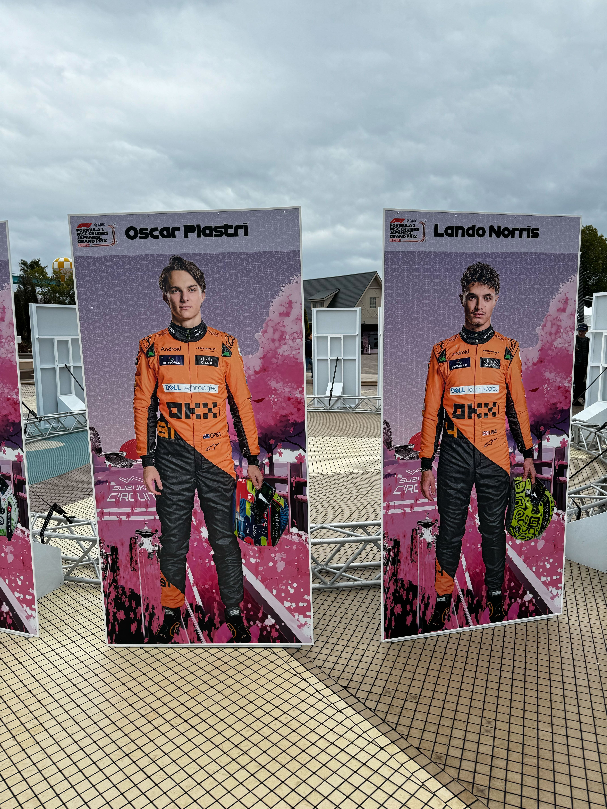

F1日本GP を見てきた。金曜から行き、無事雨に打たれるスタートだったものの、日曜日はぽかぽかで良かった。2 回目の今年は D 席にいて、S 字から抜けてくる車が逆バンクへ行くのを見届ける。今回 D と多分 E 席は迫力満点な展開になったなあ。角田さんも入賞したからかチャントも響き渡り、温かな空気を感じられた。

退場時の人の波を考えても、晴れていれば鈴鹿サーキットから白子駅までは歩いて 1 時間半弱では着けるのが分かったので、帰りの特急券の予約時間の最適さが上がりそう。何ならもう少し近いところに宿を取れれば良いのだけど、もう既に来年への戦いが始まっていることもあり、こういう経験値は必要。お金が無限にあればピット上から見たい。





  
  

    マクラーレンコンビ。今年はマクラーレン応援装備で行った。
  


